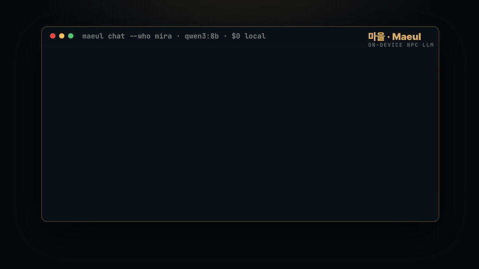

<div align="center">

# 마을 · Maeul

**A tiny, money-free LLM engine for game-village NPCs.**



<sub>Real output, local `qwen3:8b`, $0. The herbalist 미라 is cheerful at the market — until a flood hits and she panics, in character.</sub>

### ▶ [**Try the live demo**](https://muse-code-space.github.io/maeul/) — a whole village running in *your* browser

**[muse-code-space.github.io/maeul](https://muse-code-space.github.io/maeul/)** — pick a villager, talk to them, trigger a
flood, watch them react. The LLM runs **entirely in your browser** (WebGPU) — no server, no key, **$0.**
<sub>(Needs a recent desktop Chrome/Edge. First load downloads a small model once, then it's cached & offline.)</sub>

Villagers with real personalities · dialogue that changes day to day · reactions that fit the moment
(calm at the market, *terrified* in a flood) · and RAG answers grounded in **your** game's lore.

Runs 100% on your machine via local Ollama — **$0, no API key, offline.**
Or serve it to any engine over HTTP.

`pip install maeul` · MIT · Python 3.9+

</div>

---

## Why Maeul?

Game NPCs are still stuck between two bad options:

| | scripted trees (Yarn Spinner…) | cloud NPC SaaS (Inworld, Convai…) |
|---|---|---|
| Alive / improvises | ❌ fixed lines | ✅ |
| Free & offline | ✅ | ❌ per-message billing |
| Open source | ✅ | ❌ closed |
| Your world's lore | manual | limited |

**Maeul is the missing corner:** improvises like an LLM, but **open, free, on-device, and grounded in your lore.** "OpenAI-compatible" here means the *wire format* (which local runners speak) — **not a bill from OpenAI.** The default backend is your local Ollama.

## What it does

- **① Character cards** — a villager is a small JSON/YAML file: personality, speech style, fears, relationships, what they know.
- **② World context** — time, season, weather, and live **events**. A disaster flips the whole village's mood.
- **③ Memory** — bounded per-NPC memory: they remember today, and they remember you.
- **④ RAG lore** — drop in markdown; villagers answer world questions grounded in it. Pure-Python retrieval, offline, no embedding download required.
- **⑤ Structured replies** — every line comes back as `{ line, emotion, action, topic, facts }`, so you can drive faces, animations, and game logic.

## Quick start (free & local)

```bash
# 1) a free local model runner
brew install ollama            # or: https://ollama.com
ollama pull qwen3:8b           # any local model works

# 2) Maeul
pip install maeul

# 3) talk to a villager — $0, offline
python -m maeul.cli chat --who mira
```

```python
from maeul import Character, World, Villager, Backend, Lore

world = World(name="바람 마을", day=1, time="morning", weather="clear")
lore  = Lore().add_dir("examples/village/lore")

mira = Villager(
    character=Character.load("examples/village/mira.json"),
    world=world, lore=lore,
    backend=Backend(model="qwen3:8b"),   # local Ollama — no key, $0
)

print(mira.say("안녕 미라? 오늘 마을 분위기 어때?"))
# Reply(line='아이고, 어서 와요! 오늘은 햇살 진짜 좋아요…', emotion='happy', ...)
```

## The village reacts (real output, local qwen3:8b)

미라 is a herbalist who **lost her parents to a flood** — so water scares her. Watch the same villager change with the world:

```
평온한 아침   [happy]   아이고, 어서 와요! 오늘은 햇살 진짜 좋아요. 강이 불어올까 봐 좀 긴장하네요.
홍수 발생!    [scared]  아이고, 물이 너무 많아서 너무 무서워요... 약초를 안전하게 옮겨야 해요.
```

Ask the elder about history — grounded in your lore files, not hallucinated:

```
촌장 세나에게 "옛날 큰 홍수가 있었다던데?"
  [sad] 은하천이 봄에 범람했었지… 마을 서쪽은 물에 잠긴 채, 아이들이 목숨을 잃었네.
  └ grounded in: river.md ("30년 전 큰 홍수 때 강이 범람해…")
```

Same day, different villagers — different souls:

```
꼬마 핀    [happy]   토르 아저씨 대장간에서 도구 만드는 거 봤어! 진짜 멋지던데?
대장장이 토르 [worried] 흥. 내 무기들, 오늘도 괜찮은가?
```

## Use it from a game engine

Run the server (still local, still free):

```bash
pip install "maeul[server]"
maeul serve --village examples/village --model qwen3:8b
```

Then any engine POSTs to it:

```bash
curl -s localhost:8000/say -d '{"who":"mira","text":"미라 지금 괜찮아?"}'
# {"line":"약초들 좀 빨리 옮겨야 해요.","emotion":"scared","action":"수레에 약초를 실다","topic":"홍수","facts":[]}
```

Trigger a disaster the whole village feels:

```bash
curl -s localhost:8000/event -d '{"kind":"earthquake","severity":0.9,"note":"우물 옆 땅이 갈라졌다"}'
```

**Unity** (drop-in client in [`unity/Runtime/MaeulClient.cs`](unity/Runtime/MaeulClient.cs)):

```csharp
maeul.Say(who, message, reply => {
    dialogueUI.Show(reply.line);          // the spoken line
    animator.SetTrigger(reply.emotion);   // drive the face/pose
});
maeul.PushEvent("earthquake", 0.9f);      // every villager reacts, in-character
```

## Runs anywhere a local model runs

| Backend | Cost | How |
|---|---|---|
| **Local Ollama** (default) | **$0** | `Backend(model="qwen3:8b")` |
| llama.cpp / LM Studio | $0 | point `base_url` at its OpenAI endpoint |
| Any hosted OpenAI-compatible | pay-per-token *(opt-in)* | set `base_url` + `api_key` |

Tested locally with `qwen3:8b`, `ernie4.5:21b`, `deepseek-r1:8b`.

## Deploy it to the web (Railway, Render, Fly…)

The server is a plain FastAPI app — deploy it anywhere. On a cloud box (no local
Ollama) you point the model backend at a **free-tier hosted model** or your own
machine via a tunnel, so it can stay $0. `Procfile` + `railway.json` are
included. Full guide: **[docs/DEPLOY.md](docs/DEPLOY.md)**.

```bash
# cloud config is all env-driven:
PORT=8000 HOST=0.0.0.0 MAEUL_MODEL=qwen3:8b python -m maeul.cli serve
```

## Learn how it's built (course)

Maeul doubles as a **build-along course** — 11 lessons that build this exact
engine from scratch, each mapped to a real file. Great if you want to understand
LLM-driven NPCs, not just use them: **[docs/course](docs/course/)**.

## Roadmap

- [x] Core engine — characters, world, memory, RAG lore, structured replies
- [x] Local-first, zero-dependency core
- [x] HTTP server + Unity client
- [x] **In-browser, on-device** — [live WebLLM demo](https://muse-code-space.github.io/maeul/), no server, no key ([`docs/`](docs/))
- [ ] Embedded native — llama.cpp bindings for engines without a browser
- [ ] Godot & Unreal adapters
- [ ] Relationship graph & cross-villager gossip
- [ ] Voice (local TTS) hooks

## License

MIT © MUSE. Build games with it, sell them, no strings.

<div align="center"><sub>Made in Korea 🇰🇷 · <code>마을</code> means "village."</sub></div>
